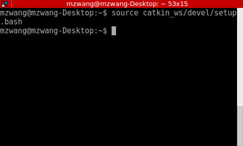

# MZ_WANG_INTERN

This ROS package demonstrates a path planner for a multiple agents scenario. This package includes two nodes: Planner and Agent. The Planner nodes provides a path planning service that implements A* to find the shortest path between a given start and a given goal on a 11*11 grid. The Agent node publishes the agent position as well as the found path returned by Planner.

This package has been tested under **Ubuntu 16.04** and **ROS Kinetic**. **C++ 11** is required for successful compilation. 

## Installation
### Dependencies
This package depends only on ROS.
### Build
```
cd catkin_ws/src
git clone https://github.com/mzwang828/mz_wang_intern.git
catkin build
```

## Usage
### Run the node
Source the workspace first:

```bash
source catkin_ws/devel/setup.bash
```

To run the 2 nodes individually:

```bash
# Start a roscre
roscore
# In a new terminal, run the planner
rosrun mz_wang_intern planner
# To run the agent, serial_ID and start_position are needed
roslaunch mz_wang_intern agent.launch serial_ID:="agent_1" start_position:=[0,0,0]
```
## Run the Test Case
**For the convinience of test, a test launch file is provided** 

Run the test.launch file will automatically start 3 nodes: the **planner**, an **agent_1** with start_position [0,0,0] and an **agent_2** with start_position [5,5,0]. Rviz will also be started to show the map and path. To run the test case:

```bash
# run the test.launch
source catkin_ws/devel/setup.bash
roslaunch mz_wang_intern test.launch
```
To plan the path, one needs to call the service in a new terminal. 

```bash
source catkin_ws/devel/setup.bash
# For agent 1
rosservice call /agent_1/update_goal "goal:
  position:
    x: 5.0
    y: 5.0
    z: 0.0"
# For agent 2
rosservice call /agent_2/update_goal "goal:
  position:
    x: 10.0
    y: 8.0
    z: 0.0"
```
**Note:** Once you source the workspace in the terminal, you can use TAB Completion to fill the service request automatically, and you only need to change those numbers.



## Screenshot
Test Case

Avoid another agent's path

Service list
